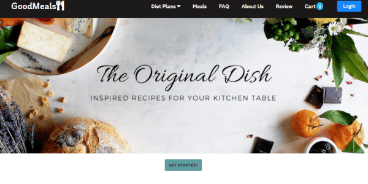

# GoodMeals: Meal-Plan Order Application

### Website Link: https://goodmeals.herokuapp.com/

## Purpose

This is a personal project.

## Product Overview

A website targeting locals who are looking to save time and money when it comes to their meals. Making use of our locally sourced ingredients, they have the option to purchase premade meals or prepped meal ingredients with recipes. Users are able to choose product delivery or pick-up for added convenience.

## Product Features

### Signup & Login

- Offers free registration and simplifies the process by requiring an email and password only.
- Only requires personal information when user wishes to purchase a plan.
- A registered user can change email and password.
- A registered user can view past orders history.

### Diet Plans

- Offers various meal plans ranging from 1 to various people
- Offers meal plans tailored to various diets for a more customizable experience. Options such as vegan, keto, vegetarian and paleo.
- A Youtube video of popular recipes is available for viewing.

### Order Systems

- Able to add meals to cart and place orders
- Option exists to expand order system to include takeout and delivery.

## Technical Skills

The website is responsive and allow mobile users to also use and place orders.

- React & Redux
- Node.js & Express
- MongoDB & Mongoose
- HTML5 & CSS3 & Material-UI
- ESLint, Github
- Heroku

## How to run

In the project directory, you can run:

1. npm install

   - node_modules will be created.

2. npm start
   - Runs the app in the development mode.\
   - Open [http://localhost:3000](http://localhost:3000) to view it in the browser.
